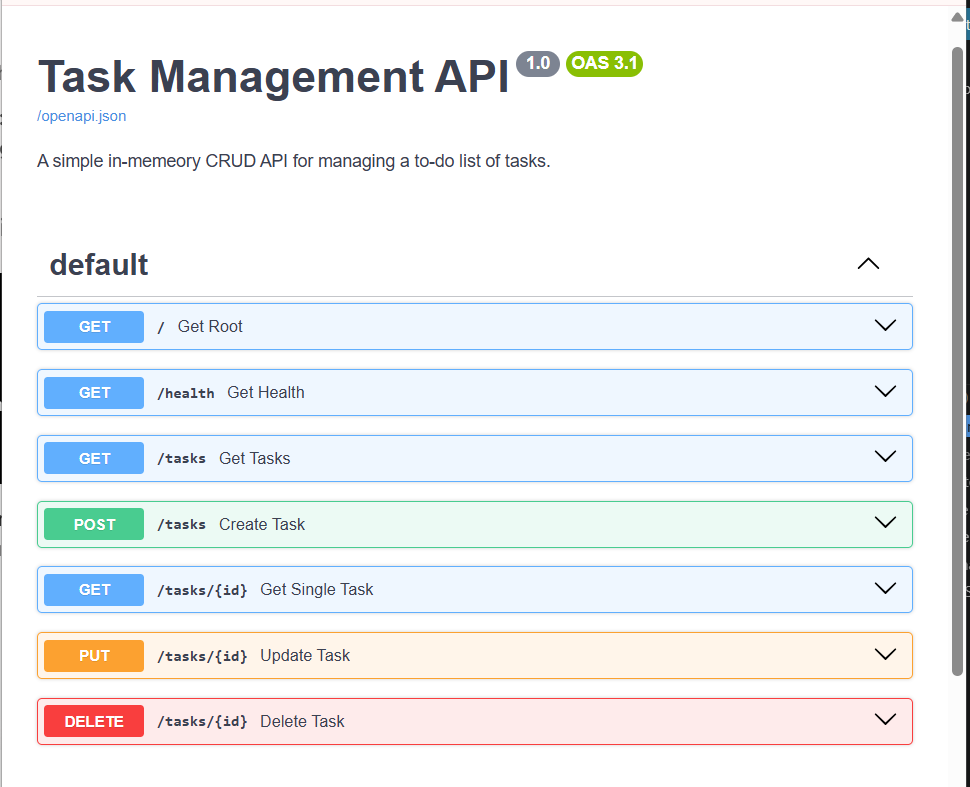

# Task Management CRUD API

A robust and lightweight in-memory CRUD API built using Python and FastAPI to manage a simple to-do list. [cite_start]This project was developed as part of the FlyRank Internship Backend Track for Week Two, Assignment AOne[cite: 1, 2, 3].

## Features

* [cite_start]**Full CRUD Support**: Create, Read, Update, and Delete tasks seamlessly[cite: 3, 18].
* [cite_start]**Input Data Validation**: Prevents empty or invalid task titles, returning proper HTTP Bad Request status codes[cite: 81, 82].
* [cite_start]**Automatic Documentation**: Interactive API testing and visualization via Swagger UI[cite: 106, 173].
* [cite_start]**In-Memory Storage**: Data persists in the application memory during runtime, utilizing a structured Python list of dictionaries as a temporary database[cite: 23, 65].

---

## Tech Stack and Tools

* [cite_start]**Language**: Python [cite: 37]
* [cite_start]**Framework**: FastAPI [cite: 37]
* [cite_start]**Web Server**: Uvicorn 
* [cite_start]**API Documentation**: Swagger UI [cite: 19]
* [cite_start]**Version Control**: Git and GitHub [cite: 37]

---

## How to Install and Run Locally

Follow these steps to run the server on your local machine:

### Clone the Repository

```bash
git clone [https://github.com/zee-ship-it/task-management-api.git](https://github.com/zee-ship-it/task-management-api.git)
Bashcd task-management-api
Install DependenciesEnsure you have FastAPI and Uvicorn installed on your system:Bashpip install fastapi uvicorn
Run the ServerStart the Uvicorn ASGI server with the reload flag enabled to monitor code changes:Bashuvicorn main:app --reload
The server will start running locally at http://127.0.0.1:8000.  API Endpoints TableMethodEndpointDescriptionExpected Status CodeGET/Retrieve API metadata and description.200 OKGET/healthHealth check to verify if the server is running.200 OKGET/tasksRetrieve the complete list of tasks.200 OKGET/tasks/{id}Retrieve a single task by its unique ID.200 OK / 404 Not FoundPOST/tasksCreate a new task (Requires input validation).201 Created / 400 Bad RequestPUT/tasks/{id}Update an existing task's title or completion status.200 OK / 400 / 404DELETE/tasks/{id}Delete a task by its unique ID.204 No Content / 404 Not FoundTerminal Testing (curl Output Example)Below is a sample terminal output when retrieving the list of tasks using curl:  Bashcurl -i [http://127.0.0.1:8000/tasks](http://127.0.0.1:8000/tasks)
ResponseJSONHTTP/1.1 200 OK
date: Thu, 16 Jul 2026 17:05:00 GMT
server: uvicorn
content-length: 198
content-type: application/json

[
  {"id": 1, "title": "Go to gym", "done": false},
  {"id": 2, "title": "Complete Assignment", "done": true},
  {"id": 3, "title": "Read a book", "done": false}
]
Swagger UI Interactive DocumentationBelow is the screenshot of the interactive API documentation interface available locally at the docs endpoint:
